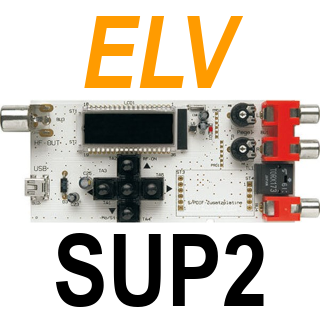

# ioBroker.elv-sup2

## elv-sup2 adapter for ioBroker

This adapter connects the ELV HQ-Stereo-FM-Testgenerator SUP2 to ioBroker via USB serial port. It allows to retrieve and set certain configuration parameters of the testgenerator among them the RDS text, RDS program name and type. SUP2 updating is not supported. Use the Windows program which is provided by ELV for this purpose.

## Configuration hints

The only configuration parameter is the serial port Id of the port to which the SUP2 is connected.
The format should be e.g.: /dev/ttyUSBx on Linux- or COMx on Windows-based ioBroker installations.

## Changelog
<!--
	Placeholder for the next version (at the beginning of the line):
	### **WORK IN PROGRESS**
-->
### **WORK IN PROGRESS** - 2025H2 maintenance release

* (pdbjjens) Change: node>=20, js-controller>=7.0.7 and admin>=7.6.17 required
* (pdbjjens) Change: Updated to ESLint 9 and serialport 13
* (pdbjjens) Change: Cleanup devDependencies

### 0.1.1 (2024-11-24) - 2025H1 maintenance release

* (pdbjjens) New: Tested with node.js 22
* (pdbjjens) Fix: Responsive Design tweaks
* (pdbjjens) New: Updated dependencies

### 0.1.0 (2024-08-29) - 2024H2 maintenance release

* (pdbjjens) Change: node>=18, js-controller>=5 and admin>=6 required
* (pdbjjens) Change: Removed .npmignore
* (pdbjjens) New: Updated dependencies

### 0.0.7 (2024-01-25)

* (pdbjjens) New: json config UI
* (pdbjjens) New: List of available serial ports in config UI

### 0.0.6 (2023-02-20)

* (pdbjjens) Third release

### 0.0.5 (2023-02-20)

* (pdbjjens) List available serial ports
* (pdbjjens) Adapter not enabled on startup

## Legal Notices

ELV and others are trademarks or registered trademarks of ELV Elektronik AG D-26787 Leer, Germany -
<https://de.elv.com/>

All other trademarks are the property of their respective owners.
The authors are in no way endorsed by or affiliated with ELV Elektronik AG, or any associated subsidiaries, logos or trademarks.

## License

MIT License

Copyright (c) 2025 pdbjjens <jjensen@t-online.de>

Permission is hereby granted, free of charge, to any person obtaining a copy
of this software and associated documentation files (the "Software"), to deal
in the Software without restriction, including without limitation the rights
to use, copy, modify, merge, publish, distribute, sublicense, and/or sell
copies of the Software, and to permit persons to whom the Software is
furnished to do so, subject to the following conditions:

The above copyright notice and this permission notice shall be included in all
copies or substantial portions of the Software.

THE SOFTWARE IS PROVIDED "AS IS", WITHOUT WARRANTY OF ANY KIND, EXPRESS OR
IMPLIED, INCLUDING BUT NOT LIMITED TO THE WARRANTIES OF MERCHANTABILITY,
FITNESS FOR A PARTICULAR PURPOSE AND NONINFRINGEMENT. IN NO EVENT SHALL THE
AUTHORS OR COPYRIGHT HOLDERS BE LIABLE FOR ANY CLAIM, DAMAGES OR OTHER
LIABILITY, WHETHER IN AN ACTION OF CONTRACT, TORT OR OTHERWISE, ARISING FROM,
OUT OF OR IN CONNECTION WITH THE SOFTWARE OR THE USE OR OTHER DEALINGS IN THE
SOFTWARE.
